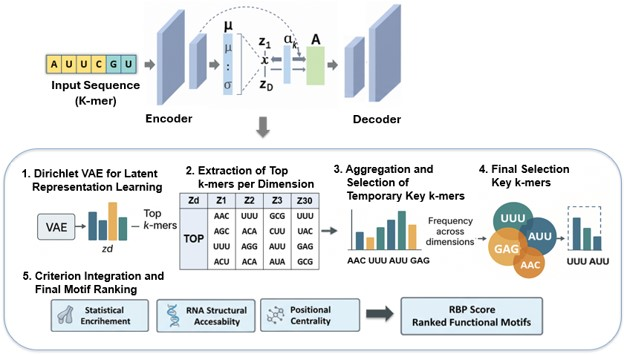

# DiRAMotif
## An Unsupervised Dirichlet-VAE Approach for RNA Motif Discovery

# DiRAMotif

**DiRAMotif** is a pipeline for discovering candidate RNA-binding protein (RBP) motifs from CLIP-seq–derived RNA sequences. It combines k-mer frequency features, a Dirichlet-prior Variational Autoencoder (VAE), and biologically informed post-processing (enrichment, RNA accessibility, and positional centrality scoring) to produce ranked motif candidates and position weight matrices (PWMs) for each RBP.



## Overview

For each RBP dataset, the pipeline:

1. Extracts k-mer frequency vectors from RNA sequences (default `k = 6`).
2. Trains a Dirichlet-VAE independently on the k-mer feature space to learn a compact latent representation.
3. Identifies candidate motifs by examining which k-mers are enriched among the sequences most active along each latent dimension.
4. Scores each candidate motif using:
   - **Enrichment** — Fisher's exact test against a background sequence set, with Benjamini–Hochberg FDR correction.
   - **Accessibility** — RNA structural accessibility at the motif site, from real icSHAPE scores when available or ViennaRNA-computed base-pairing probabilities otherwise.
   - **Centrality** — how close the motif occurrences are to the center of each CLIP peak.
5. Builds a position weight matrix (PWM) for every candidate motif from non-overlapping occurrences (selected greedily by minimum Hamming distance), using a relative pseudocount and a central-window filter to reduce edge noise.
6. Optionally compares the resulting PWMs against a reference motif database (e.g., ATtRACT) using Tomtom, with empirical background nucleotide frequencies.
7. Optionally runs a latent-dimension sensitivity analysis and a multi-*k* robustness analysis (k ∈ {4, 5, 6, 7}) to check that findings are not artifacts of a single hyperparameter choice.

## Repository contents

- `DiRAMotif_pipeline.py` — the full pipeline: feature extraction, model, training, motif scoring, PWM construction, Tomtom comparison, and batch execution over multiple proteins.
- Datasets, data preprocessing pipelines, model training scripts, and configuration files required to reproduce the experiments in the associated paper.

## Requirements

- Python ≥ 3.8
- PyTorch
- NumPy, pandas, scikit-learn, statsmodels
- Biopython
- ViennaRNA (Python bindings, `RNA` package)
- matplotlib, seaborn
- [MEME Suite](https://meme-suite.org/) (for the `tomtom` command-line tool; only required if you run the Tomtom comparison step)

Install the Python dependencies with:

```bash
pip install torch numpy pandas scikit-learn statsmodels biopython matplotlib seaborn
```

ViennaRNA and the MEME Suite are typically installed via conda:

```bash
conda install -c bioconda viennarna meme
```

## Data

The pipeline expects one FASTA/JSON file set per RBP experiment, named by a shared `{protein_name}` prefix:

| File | Suffix | Required |
|---|---|---|
| Training sequences | `_train.fasta` | Yes |
| Test/held-out sequences | `_test.fasta` | Yes |
| icSHAPE accessibility scores | `_icshape.json` | Optional — falls back to ViennaRNA-computed accessibility |

Two CLIP-seq dataset sources were used in the accompanying study:

- The dataset introduced in the **iONMF** study, available at [github.com/mstrazar/ionmf](https://github.com/mstrazar/ionmf)
- The dataset introduced in the **PrismNet** study, available at [github.com/kuixu/PrismNet](https://github.com/kuixu/PrismNet)

## Usage

### Single protein

```python
from DiRAMotif_pipeline import run_full_pipeline_for_protein

result = run_full_pipeline_for_protein(
    protein_name="EIF4A3_HEK293",
    train_fasta="data/EIF4A3_HEK293_train.fasta",
    test_fasta="data/EIF4A3_HEK293_test.fasta",
    icshape_json="data/EIF4A3_HEK293_icshape.json",        # optional
    k=6,
    hidden_dim=200,
    latent_dim=30,
    epochs=100,
    attract_meme_file="attract_db.meme",                   # optional
    output_root="./rna_motif_results",
)
```

### Batch mode (all proteins in a data directory)

```python
from DiRAMotif_pipeline import run_batch_pipeline

summary = run_batch_pipeline(
    data_dir="./data",
    output_root="./rna_motif_results",
    k=6,
    hidden_dim=200,
    latent_dim=30,
    epochs=100,
)
```

`run_batch_pipeline` automatically discovers all `{protein_name}_train.fasta` / `_test.fasta` pairs in `data_dir`, matching optional negative-set and icSHAPE files by the same prefix, and writes a combined `summary_all_proteins.csv`.

You can also run the script directly:

```bash
python DiRAMotif_pipeline.py
```

Edit the `DATA_DIR`, `OUTPUT_ROOT`, and `ATTRACT_MEME_FILE` variables at the bottom of the script (under `if __name__ == "__main__":`) to point to your own data and reference database.

## Output

For each protein, the pipeline writes to `{output_root}/{protein_name}/`:

- `*_model_weights.pth` — trained VAE weights
- `*_loss_curves.jpg`, `*_loss_history.json` — training diagnostics
- `*_latent_heatmap.jpg`, `*_latent_distribution.jpg`, `*_reconstruction_error_dist.jpg` — latent-space diagnostics
- `*_rbp_specific_motif_report.txt`, `*_rbp_motif_scores.csv` — ranked candidate motifs with enrichment, accessibility, and centrality scores
- `*_motif_activity_heatmap.jpg` — motif activity across latent dimensions
- `*motifs.meme`, `*pwm_summary.csv`, `*_background.txt` — PWMs in MEME format, per-motif PWM statistics, and background nucleotide frequencies
- `*_tomtom_out/`, `*_tomtom_full_results.csv`, `*_tomtom_agreement_summary.csv` — Tomtom comparison results (if `attract_meme_file` is provided)
- `*_latent_dim_sensitivity.csv/.jpg` — latent-dimension sensitivity analysis (optional)
- `*_table5_multi_k_robustness.csv` — multi-*k* robustness analysis (optional)
- `*_run_config.json` — full configuration used for the run

A combined `summary_all_proteins.csv` is written to `output_root` when running in batch mode.

## Citation

If you use this pipeline in your research, please cite the associated paper (citation details to be added upon publication).

## License

Add your chosen license here (e.g., MIT, Apache-2.0, GPL-3.0).
